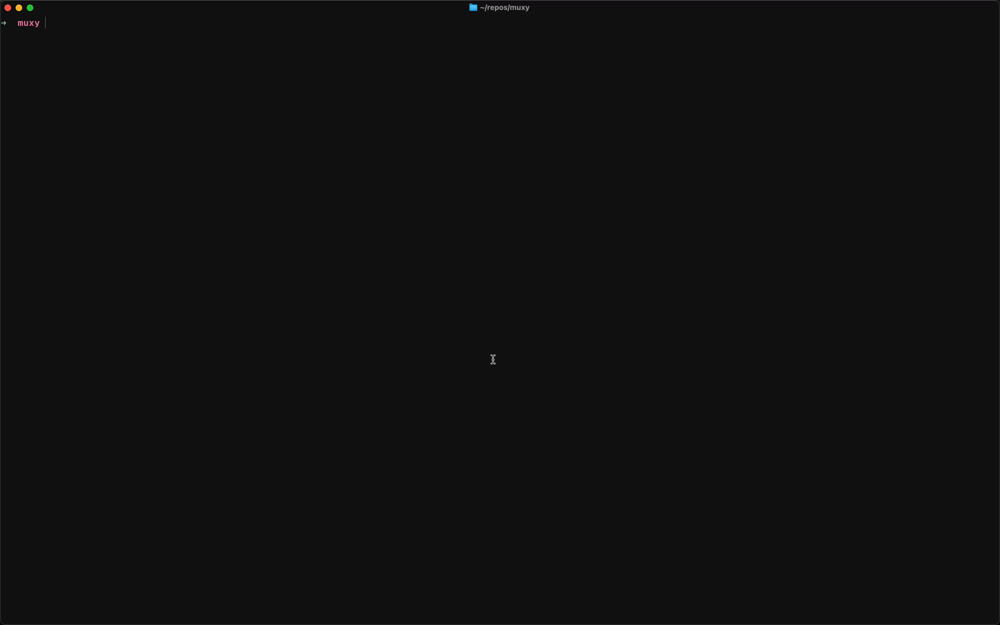

# 🔥 muxy

A beautiful terminal multiplexer for running multiple processes. Built with Go, powered by tcell.

<p align="center">
  
  
</p>

<p align="center">
  
</p>

## ✨ Features

- **🖥️ Full Terminal Emulation** - Each process gets a real PTY with ANSI support
- **⌨️ Interactive Mode** - Press Enter to focus and interact with any process
- **🎨 Beautiful UI** - Color-coded processes with smart grouping
- **📊 Smart Status** - Distinguishes crashes from clean exits
- **🚀 Zero Config** - Works out of the box with sensible defaults
- **⚡ Keyboard First** - Vim-style navigation (j/k) and shortcuts
- **📝 YAML Config** - Simple, readable configuration
- **🔄 Dynamic Reordering** - Running processes at top, stopped at bottom
- **🎯 Scroll Support** - Mouse wheel and keyboard scrolling

## 🎬 Quick Start

```bash
# Install
go install github.com/dgocoder/muxy@latest

# Run (uses muxy.yml by default)
muxy

# Or specify a config file
muxy config.yml

# Or build from source
git clone https://github.com/dgocoder/muxy
cd muxy
go build -o muxy main.go
./muxy examples/fullstack.yml
```

## 📖 Usage

Create a `muxy.yml`:

```yaml
title: myproject # Optional: appears in sidebar (defaults to "MUXY")
splash: banner.txt # Optional: custom ASCII art

processes:
  - name: api
    command: npm run dev
    directory: ./backend
    color: green
    environment:
      PORT: "3000"

  - name: web
    command: npm start
    directory: ./frontend
    color: blue
    environment:
      PORT: "3001"
```

Then run:

```bash
muxy  # Uses muxy.yml by default
```

## ⌨️ Keyboard Shortcuts

### Navigation Mode

| Key               | Action                                |
| ----------------- | ------------------------------------- |
| `Tab` / `j`       | Next process                          |
| `Shift+Tab` / `k` | Previous process                      |
| `Enter`           | Focus into process (interactive mode) |
| `x`               | Kill selected process                 |
| `q` / `Ctrl+C`    | Quit (terminates all)                 |
| `u` / `d`         | Scroll up/down                        |

### Focused Mode

| Key            | Action                           |
| -------------- | -------------------------------- |
| `Ctrl+Z`       | Exit focus, return to navigation |
| All other keys | Sent directly to the process     |

## 🎨 Status Indicators

muxy intelligently groups and displays process status:

```
Running Processes
 ● api          (green - running)
 ● web          (blue - running)
────────────────────────
Stopped Processes
 ◯ mobile       (dimmed - not started)
 ○ worker       (dimmed - clean exit)
 ✗ database     (red - crashed)
```

- **`●`** (colored) - Running
- **`◯`** (dimmed) - Not started (`autostart: false`)
- **`○`** (dimmed) - Clean exit (code 0) or manual kill
- **`✗`** (red) - Crashed (non-zero exit code)

## 📋 Configuration Reference

### Global Options

```yaml
title: myproject # Sidebar header (optional, default: "MUXY")
splash: splash.txt # Custom ASCII art file (optional)
```

### Process Options

```yaml
processes:
  - name: api # Required: Display name
    command: npm run dev # Required: Command to run
    directory: ./app # Optional: Working directory
    color: green # Optional: green|blue|red|yellow|magenta|cyan|white|gray
    autostart: true # Optional: Start automatically (default: true)
    environment: # Optional: Environment variables (values support ${VAR} substitution)
      PORT: "${PORT:-3000}" # With default value
      NODE_ENV: dev
```

## 🎯 Example

Check out [`examples/fullstack.yml`](./examples/fullstack.yml) for a complete example:

### Full-Stack Example

```yaml
title: fullstack
processes:
  - name: postgres
    command: docker run --rm -p 5432:5432 postgres:15-alpine
    color: blue

  - name: api
    command: npm run dev
    directory: ./server
    color: green
    environment:
      DATABASE_URL: postgresql://localhost:5432/myapp
      PORT: "4000"

  - name: web
    command: npm start
    directory: ./client
    color: cyan
    environment:
      REACT_APP_API_URL: http://localhost:4000
      PORT: "3000"
```

## 🔧 Advanced Features

### Environment Variable Substitution

muxy supports dynamic environment variable substitution using `${VAR_NAME}` syntax. This works in:
- Process commands
- Directory paths
- Environment variable values
- Any string field in the config

```yaml
processes:
  - name: api
    command: npm run dev
    directory: ${WORK_DIR:-./backend}
    environment:
      PORT: "${API_PORT:-4000}"
      DATABASE_URL: "postgresql://${DB_HOST:-localhost}:${DB_PORT:-5432}/${DB_NAME:-myapp}"
      NODE_ENV: "${NODE_ENV:-development}"
```

**Default values:** Use `${VAR:-default}` syntax to provide fallback values when the environment variable is not set.

See [`examples/env-vars.yml`](./examples/env-vars.yml) for a complete example.

### Manual Start Processes

Set `autostart: false` for processes you want to start manually:

```yaml
processes:
  - name: mobile
    command: npm run ios
    autostart: false # Press Enter to start when ready
```

### Custom Splash Screen

Create a text file with ASCII art:

```
 __  __  _   _ __  ____   __
|  \/  || | | |\ \/ /\ \ / /
| |\/| || | | | \  /  \ V /
| |  | || |_| | /  \   | |
|_|  |_| \___/ /_/\_\  |_|
```

Reference it in your config:

```yaml
splash: ./my-banner.txt
```

## 🤔 Why muxy?

**vs tmux/screen**

- ✅ Simpler: YAML config vs complex key bindings
- ✅ Modern: Built-in colors, status indicators
- ✅ Process-centric: Manages apps, not shells

**vs Overmind/Foreman**

- ✅ Interactive mode: Focus into processes
- ✅ Better UX: Grouped status, scroll support
- ✅ Single binary: No Ruby/dependencies

**vs Concurrently**

- ✅ Full terminal: Not just log aggregation
- ✅ Interactive: Can send input to processes
- ✅ Visual: Sidebar navigation and status

## 🏗️ Architecture

muxy uses:

- **[tcell](https://github.com/gdamore/tcell)** - Terminal UI framework
- **[tcell-term](https://github.com/sst/sst)** - Terminal emulator (from SST)
- **PTY** - Each process gets a real pseudo-terminal

This means every process gets full terminal emulation:

- ✅ Colors and ANSI codes
- ✅ Interactive prompts
- ✅ Cursor control
- ✅ Terminal resizing

## 🐛 Troubleshooting

**Process won't start**

- Verify the command works in a regular shell
- Check the `directory` path exists
- Confirm environment variables are correct

**Can't exit**

- If focused: Press `Ctrl+Z` to unfocus first
- Then press `q` or `Ctrl+C` to quit

**Garbled output**

- Try resizing your terminal window
- Some TUI apps may conflict - use `autostart: false` and run separately

## 🛠️ Building from Source

```bash
git clone https://github.com/dgocoder/muxy
cd muxy
go mod download
go build -o muxy main.go
```

### Development

```bash
# Run tests
go test ./...

# Build for multiple platforms
GOOS=linux GOARCH=amd64 go build -o muxy-linux-amd64
GOOS=darwin GOARCH=arm64 go build -o muxy-darwin-arm64
GOOS=windows GOARCH=amd64 go build -o muxy-windows-amd64.exe
```

## 📝 License

MIT License - see [LICENSE](LICENSE) for details

## 🙏 Credits

Inspired by:

- [SST's mosaic mode](https://github.com/sst/sst) - Terminal emulation
- [Overmind](https://github.com/DarthSim/overmind) - Process management UX
- [tmux](https://github.com/tmux/tmux) - Terminal multiplexing

Built with ❤️ using Go and tcell.

---

<p align="center">
  <b>⭐ Star us on GitHub if you find muxy useful!</b>
</p>
